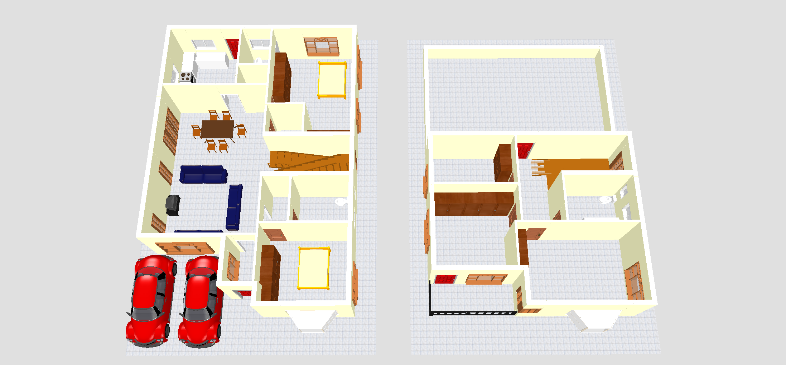
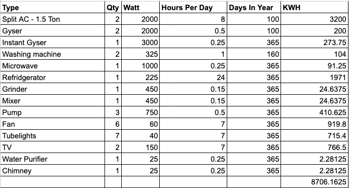

Various steps to follow to build a house in Bangalore.

## Measuring 

Always measure the site before the planning starts. There may be differences in dimension which when discovered 
later will impact the plan.
Note down the directions (North, South, East, West) which will be useful.

{}
Talk to the neighbours and get an understanding of rain water flow in the area and if any flooding happens, this 
will impact the design.
{}

{}
Sometimes dimensions will be correct but the site won't be a perfect rectangle, do check if the site corners are 
perpendicular.
{}

## Legal documents

Get your legal documents ready.

* Title deed / Sale deed / Parent deed / Master deed - Agreement of sale / title - Primary document that shows who 
  owns the property.
* Gift deed - Agreement of transfer of ownership in case the plot is gifted.
* Khata Certificate - Shows the owner of the land as per BBMP records. You get this done in your local BBMP office. 
  Take a 1-2 week time without any bribe if all documents are in order.
* Encumbrance Certificate - Shows if there are any loans on the site. You get this done in your local sub-registrar 
  office. Takes 1 month time  without any bribe if all documents are in order.

## Vaastu

* Kitchen to the south east.
* Master bedroom to the south west.
* Entrance & Car parking in north east.
* Sump tank to be in the north east.
* Pooja room not to be next to / below / above bathrooms.

## Architect

There are 2 types of architects in Bangalore

* Architects who are registered with BBMP and do house plans for approval only.
* Architects who are not registered with BBMP and do house plans for construction.

Chart out a layout of how you want the floor plan to look like, Questions to discuss with architect

* How many members in the family?
* How many floors?
* How many bedrooms?
* Attached toilet for all bedrooms or common toilets?
* Closed car parking or open parking?
* Single or multiple car parking.
* How many floor & if rent out or commercial rent out is needed.
* Future expansion plans if any.
* New trends or ideas you have in mind?
* Space utilisation

The Architect will provide

1. BBMP approved plan
2. Floor plan
3. Electrical plan
4. RCC Column & Structural plan
5. Wardrobe layout plan
6. Doors & Window dimension plan

[Floor Planner](http://www.floorplanner.com/)

[Sweet Home 3D](http://www.sweethome3d.com/index.jsp)

[Free CAD](https://www.freecad.org/)

## Choices

* Serial car parking Vs Parallel car parking - Serial car parking makes it difficult to take 2 cars in and out. 
  Minimum dimension should be 8'x16' to park sedan car and 8'x13 to park compact car. Parallel parking makes it easy 
  to take 2 cars in and out. Minimum standard dimension should be 18'x16' to park 2 sedan cars and 16'x16' to park 2 
  compact cars. Garages can be put in the corner and you need not leave setback on side and back, this is an 
  advantage in terms of space utilization however if you leave the complete pathway on one side you will loose more space.

* Stilt Vs Ground VS Basement parking - Stilt parking efficient if parking more than 2 cars although without 
  lifts it become difficult for old age folks to reside. Basement parking is risky in low lying areas and during 
  rainy season the clogged drainages can lead to flooding. Basements can develop dampness if its closed it can lead 
  to stale air and also invite roaches if windows are at ground level.

* Privacy Vs Open spaces - If you need more privacy in the house when people visit you then you need to separate out 
  the living and dining rooms. If you don't then you get a bigger area which is combined of living and dining.

* Inverted T-Beams Vs Concealed Beams - If the room dimension is bigger than 15x15 then its ideal to go in for a 
  T-Beam. If inverted T-Beam is used then the room ceiling looks cleaner and the room looks longer. 

* Granite Vs vitrified Vs Marble - A white floor reflects more light, brightness up the room. Granite is naturally 
  occurring stone so finding shades of white are difficult, grains without any fault line are also difficult to find.
  Vitrified has lot more options and cost effective but vitrified has the tendency to chip off & expand during 
  summer causing them to bubble up if no expansion joint is provided. Vitrified has the tendency of chipping and 
  cracking when heavy objects are dropped. Marble is very delicate and reacts to chemicals easily and is hard to 
  maintain. 
 
* Ceiling height VS False ceiling - False ceiling in the long run is more 
  difficult to maintain. Dust will gather around the false ceiling and cause health problems. Ceiling heights are 
  standard of 10' some go to 11' making the room look bigger. If you go in for a 11' ceiling then you will pay more  
  in terms of air conditioning keep that in mind.

* Wood windows VS UPVC windows - Wood windows need to be painted, whereas UPVC can last longer.

* Brick Vs Cement Block - Cement block work out cheap and easy in terms of construction. Brick remain cooler in 
  summer compared to cement brick wall. Brick outer walls are usually 9" and cement outer walls are usually 6". 

* Fe415 TMT Vs Fe 500 TMT - Fe500 Steel is used in high rise buildings and bridges has more strength, for normal 
  residential buildings Fe415 is sufficient. FE500D is more ductile than the FE500 used in the high seismic prone 
  zones. Make sure there is no rust and its ISI marked.

* Cut Lintel Vs Through Lintel - Lintel support the weight of the bricks on top of the window & makes sure windows dont 
  deform. For earthquake resistance the benefit of having through lintel is that it wont allow the columns to twist. 
  Places which have longer windows are suitable for through lintel. Make sure the alignment of columns doesn't 
  deviate, in cut lintels the columns raise all the way upto the roof, in through lintels they raise till lintel 
  level so extra care needs to be taken to make sure the columns don't shift from centre line.

* Sunken Slab for Bathroom - If the bathroom are planned on the first floor try to align the ground floor bathroom 
  also on the same side so that roof slab can be sunk by 6". That way the pipes can be shared and the first floor 
  bathroom will be on the same level as the floor.

* Cement 43 Grade Vs 53 Grade vs PPC - For RCC columns ideally 53 Grade cement is used as it provides higher strength,
  it requires more water during the curing stage. 43 grade cement is used for brick work, PPC is mix of fly ash with 
  cement this seals the minute holes in cement and requires less water to set and less cracks are seen & PPC based 
  cements are used for inside wall plastering.

* Spiral Staircase vs Normal Staircase - Spiral staircase look grand but space under it is wasted. In a normal 
  staircase the space under it can be used as cabinets. Steps should raise between 6" and 7" for comfort in climbing 
  anything more will hurt the knees in old age. A single step should be at-least 10" wide (tread) to give enough 
  footing. Use laputra finish granite for steps as it will give a rough surface and wont be slippery.

* Mud bricks come in 2 varieties one that is 6 Rs/brick with rough edges used for walls, 8 Rs/Brick which has
  smooth edges and used when brick work is exposed.

## BBMP Approval

1. Plan approval - You can only begin construction after plan is approved. Valid for upto 2 years.
2. Road Cutting approval - Once construction is complete after inspection you will need road cutting permission to 
   connect the electrical, water, sewage lines.
3. Occupancy certificate - Indicates that house is ready to move in. Most residential houses usually don't go for this.

BBMP Road cutting charges

## Tips

* Have cross ventilation, its ideal if the rooms (Kitchen, Master bedroom) and hence these should come in the corner 
  of the plot.
* Ensure slope for draining excess rain water is always provided correctly. Water should take the shortest path out 
  of the house to prevent flooding.
* Two room doors should never open to each other, they should not face each other and should be seperated by some 
  distance if possible.
* For safety against earthquake interlocking of RCC columns is done at plint level, you can also interlock them 
  at lintel level.
* If you plan to wall mount a TV then provide a 5" pipe within the wall during construction to conceal all the 
  cables. You will get a cleaner view when there are no cables dangling.
* If you plan to have wired network connection, iter-com, home theater & security camera then provide conduits 
  accordingly.
* Interior walls on need 3 coats of putty, sanding with sandpaper and 1 coat primer. The 1 coat primer is applied so 
  that the paint absorption is less else the walls will soak up more paint and it will take more paint to get the 
  true colour on the walls.
* If you plan to install a chimney provide a exit hole as close to the stove as possible. A longer duct reduces 
  effectiveness of the suction. Avoid bends in the suction pipe.
* Plan for a place to keep these items
  1. Washing machine
  2. Step Ladder
  3. Wet Grinder
  4. Iron board
  5. Repair Tools
  6. UPS battery
* The exact height for a kitchen slab must be 3'2".
* Use marine plywood for kitchen cabinets.
* Rain water harvesting is mandatory for all sites greater than 30x40.
* Provision electricity charging points for electric cars.

[Paint Visualizer](https://www.sherwin-williams.com/visualizer/)

## Electrical Load

Load = (qty*watt*hours*days)/1000

The below calculation shows a 8kwh load.

## Timeline

For a G+1 house 

1.  Excavation as per drawing 2 Weeks
2.  Footing/Foundation 2 Weeks
3.  Pillars/Columns (up to plinth level) 2 Weeks
4.  Soil filling in trenches; compaction till ground level 1 Week
5.  Plinth construction 2 Weeks
6.  Pillars upto lintel level 2 Weeks
7.  Lintel 4 Weeks
8.  Filling up to lintel level 2 Weeks
9.  Soil filling and compaction till plinth level 2 Weeks
10.  Roof slab 5 Weeks
11.  Brickwork and curing 7 Weeks
12.  Ducts for electrical wiring 2 Weeks
13.  Frames for doors and windows 1 Week
14.  Plastering and curing 3 Weeks
15.  Water treatment/heat treatment 1 Week
16.  Furnishing 2 Weeks
17.  Flooring/Tiling 4 Weeks
18.  Electrical wiring 3 Weeks
19.  Water supply, sanitary and plumbing 3 Weeks
20.  Doors and windows 3 Weeks
21.  Painting 4 Weeks
22.  Electricity and drainage connections 2 Weeks
23.  Inside furnishing 2 Weeks

Total: 58 Weeks = 13 Months.

With some parallel activities this can be reduced to 8-9 Months.

## Downloads

1. Download the Architect & Owner Agreement
2. Download the Contractor & Owner Agreement
3. Download the Contractor Estimate
4. [Revised Master Plan 2015](Revised_Master_Plan_2015.pdf)
5. [Occupancy Certificate Penalty & Fines](Penalty_And_Fines.pdf)
