We will look at various part of Kent Maxx water filter and how to repair or replace the fitlers it.

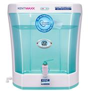

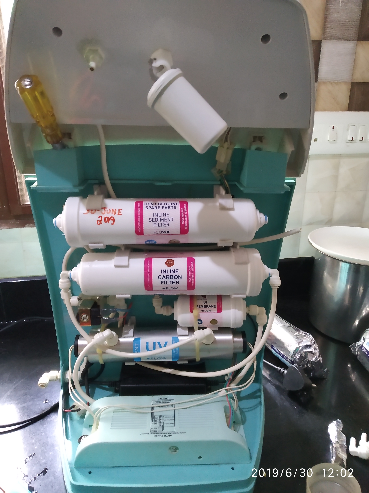

## The flow diagram

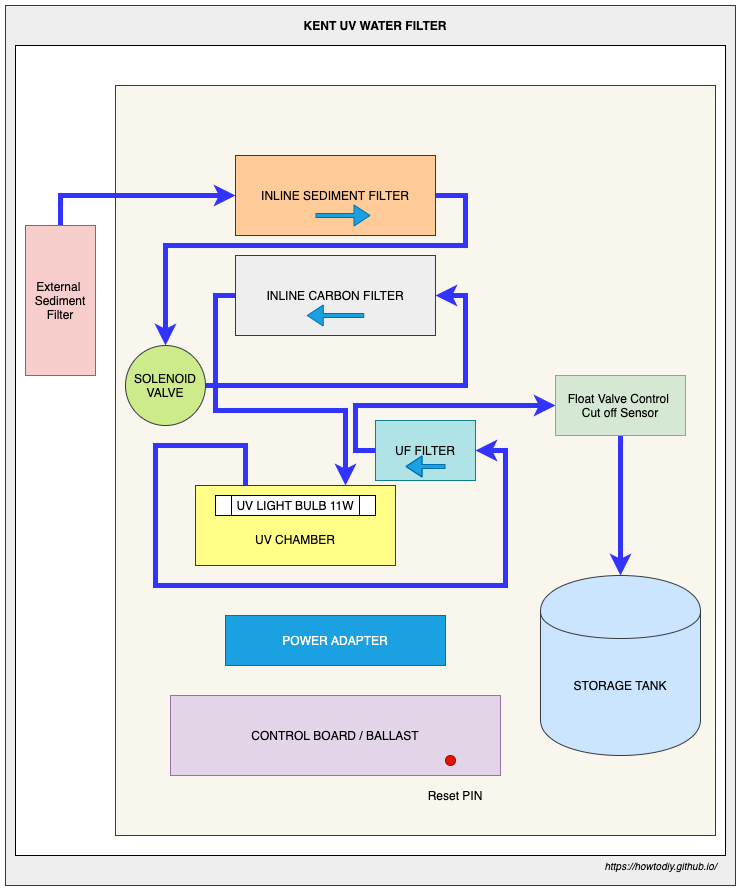

## Parts

A solenoid valve turns the tap on if power is supplied to it. If not power is supplied to it, it remains off.

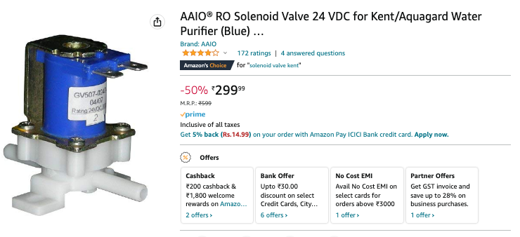

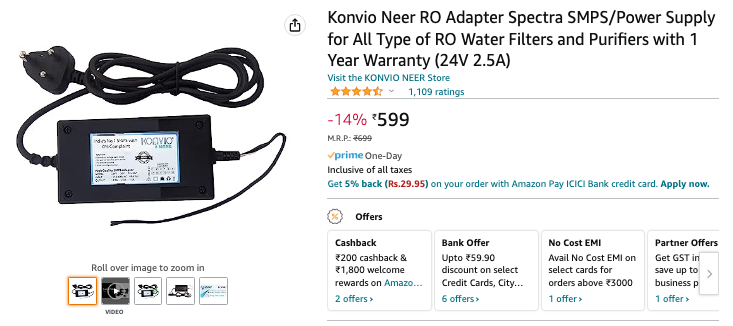

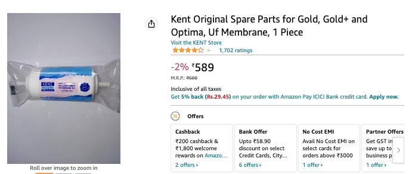

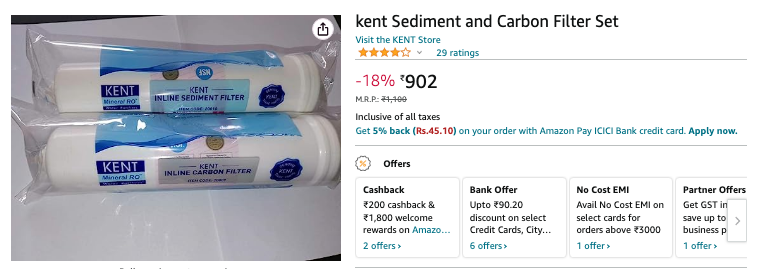

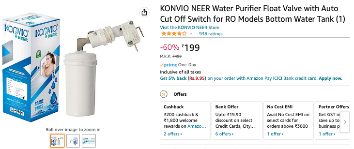

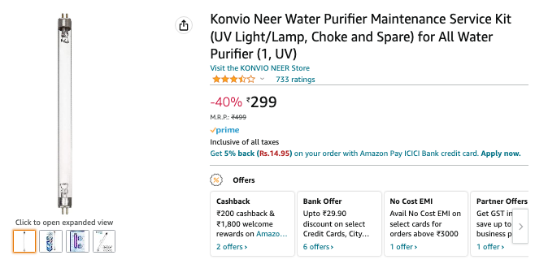

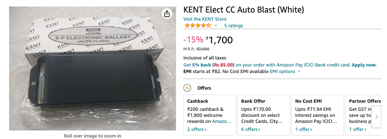

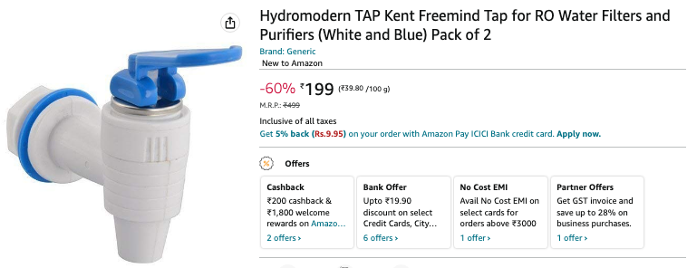

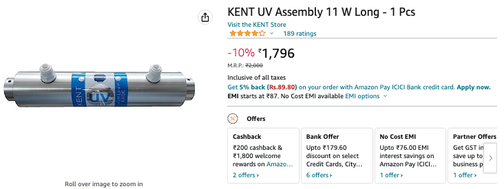

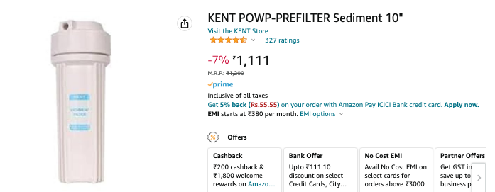
