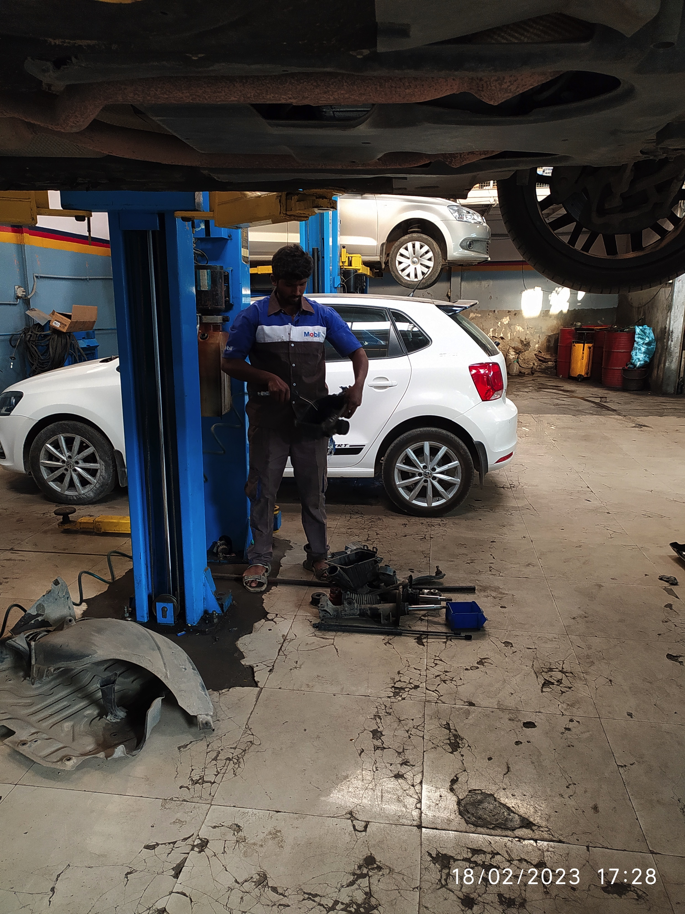

Getting your car serviced in authorized service centers has become costly.
If your car is still under warranty you should get your car serviced at authorized service centers as warranty will
be void if you get it repaired/serviced at non-authorized service centers.

If your car is out of warranty, and you want to DIY here are the steps

We will look at how to service a Maruti S Cross 1.3 DDiS car, Diesel Model 2015.

## Parts

Get all the parts yourself so that you can be sure of the quality.

{}
GST on parts purchased directly from shops is around 9%, where GST on parts in authorized service center is around 28%.
{}

| Part                                         | Cost       |
|:---------------------------------------------|:-----------|
| Mobil Super 5W-30 Fully Synthetic Engine Oil | 1,992.00   |
| Air Filter                                   | 245.76     |
| Oil Filter  (Diesel)                         | 326.27     |
| Fuel Filter                                  | 1033.89    |
| Brake Fluid 100 ML                           | 69.49      |
| AC filter                                    | 320.33     |
| Screen wash 50 ML (2)                        | 28.8       |
| Coolant (3)                                  | 711.84     |
| Bulb 12V - 55W (2)                           | 422.02     |

"ESSARR AUTOMOTIVES" sells genuine Maruti parts and prices are affordable, You can also buy Bosch parts or buy the
parts from Amazon.

Check your car manual and find out the oil type recommended for your car. Mine was 5W30 and i choose synthetic oil
as it is better for the engine compared to semi-synthetic and mineral oil. You can also buy oil at the Maruti store.

[ESSARR AUTOMOTIVES - Bannerghatta Road](https://g.co/kgs/d6Q6Qi)

## Labour

Find an auto car garage around that has the proper tools to service your car.

| Labour                    | Cost  |
|:--------------------------|:------|
| Oil & oil filter change   | 400   |
| Air filter change         | 100   |
| AC filter change          | 100   |
| Fuel Filter change        | 700   |
| Front brake pad cleaning  | 500   |
| Rear brake pad cleaning   | 500   |

[Kanishka Bosch Car Service - Bommanahalli](https://g.co/kgs/EPiJv7)

Change the air filter. Use a air pressure nozzle to clean the dirt in the box before installing new air filter.

Fuel filter (Diesel) needs to be changed for every 20k km. Change the fuel filter. It will take a couple to attempts 
to restart the car after fuel filter change as the fuel needs re-enter the lines.

{}
Check for any leakages by running it in idle for few mins.
{}

Change the oil filter for every 10k km. Dip the fuel filter in oil and change the o-ring as well.

Drain the old engine oil by removing the drain nut under the car, once complete put back the drain nut and pour the
new oil. Check the level with the dipstick.

Change the AC filter

Caliper pin greasing and brake pad cleaning can be done, but is optional.
Check for wear and tear on the brake pad, gently clean the brake pad using a sand paper.

{}
Always remember to ask for silicon based grease for caliper pin greasing as it is required for high temperature usage.
{}

Top up brake fluid if required, drain the coolant and replace new coolant with 50:50 coolant & distilled water mix.

Add the screen wash along with water.

## Car Wash

Goto a dedicated car wash shop where the clean the car properly. Ensure that under body & engine bay of the car is also
washed.

| Labour               | Cost  |
|:---------------------|:------|
| Car wash & Vacuuming | 500   |

## Wheel balancing and Rotation

Wheel balancing and rotation can be done if required. Mark your tyre so that you can record the wheel rotation over
a few years.

My tubless tyre had a bleeding air problem where it used to leak air and loose pressure over a few days, hence i got
the neck valve on all tyre replaced.

| Labour                         | Cost  |
|:-------------------------------|:------|
| Neck valve replacement 4 tyres | 500   |

| Part         | Cost   |
|:-------------|:-------|
| Neck valve 5 | 345 Rs |

## Engine de-carbonization & AC gas filling

If the AC is not cooling effectively you can get the AC serviced. If the car is stalling then you can get EGR valve
cleaned.

{}
Diesel cars dont have spark plug, only petrol cars have spark plug.
{}

[SLN engine decarbonization and AC automatic service - Arekere](https://goo.gl/maps/qHJpj9B2DB4Ws5QX7)

## Schedule

Here is the typical schedule for parts change and price for Maruti S Cross Diesel (1.3 engine) car.

| Type                                           | Period       | Part cost |
|:-----------------------------------------------|:-------------|:----------|
| Engine Oil (3.2 Litre, Synthetic)              | Every 10k km | 2000      |
| Oil Filter (Diesel)                            | Every 10k km | 350       |
| Air Filter                                     | Every 10k km | 250       |
| AC Filter                                      | Every 20k km | 350       |
| Brake Pad Cleaning and Caliper Pin Greasing    | Every 20k km | 1000      |
| Wiper Fluid                                    | Every 10k km | 45        |
| Coolant 50:50 - Coolant to Distilled Water     | Every 20k km | 800       |
| Battery checkup                                | Every 10k km | 0         |
| Headlight checkup                              | Every 10k km | 0         |
| Fuel Filter                                    | Every 20k km | 1100      |
| Wheel Balancing & Tyre Rotation                | Every 20k km | 1000      |
| EGR Valve Cleaning (Diesel, only in DDIS 200)  | Every 30k km | 1000      |
| Brake fluid change                             | If Required  | 500       |
| Clutch Fluid                                   | If Required  | 500       |
| Front brake pad replace                        | If Required  | 2750      |
| Rear brake pad replace                         | If Required  | 2750      |
| Clutch Plate Assembly                          | If Required  | 10000     |
| Disc for brake                                 | If Required  | 3500      |
| Pair of tyre                                   | If Required  | 15000     |
| AC Servicing with Gas Refill                   | If Required  | 2500      |
| Front & Rear Wiper Blade                       | If Required  | 500       |
| New Battery                                    | If Required  | 6000      |
| Front Shock Absorber One Pair                  | If Required  | 3500      |
| Rear Shock Absorber One Pair                   | If Required  | 3500      |
| Timing chain belt replacement                  | If Required  | -         |
| Turbo Charger                                  | If Required  | 35000     |
| Engine Flusing                                 | If Required  | 350       |
| Radiator cleaning                              | If Required  | -         |
| Gear oil replacement                           | If Required  | -         |
